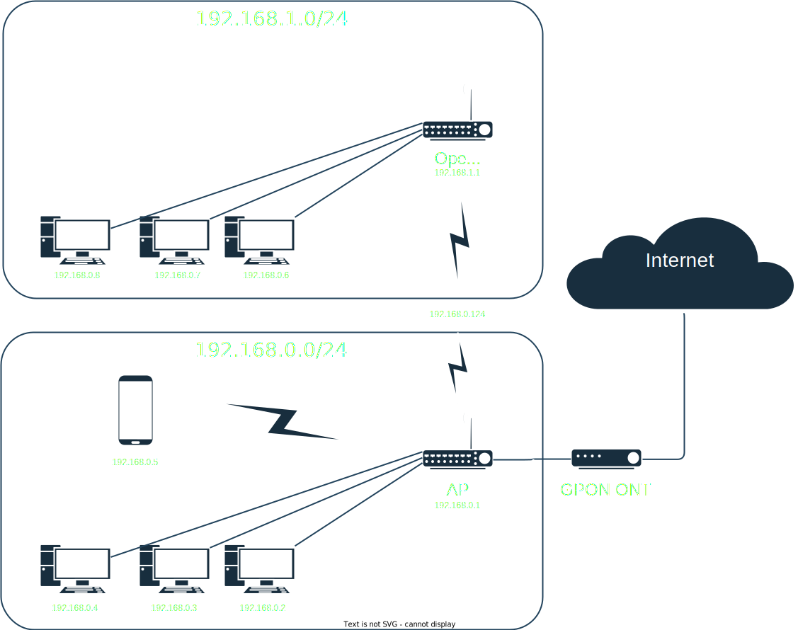

<!-- markdownlint-configure-file { "MD010": { "code_blocks": false } } -->
# OpenWrt Wireless Netwrork Bridge (With IPv6 Support)

<p align="center">

</p>

## Goals

- To use OpenWrt Router as a wifi adapter instead of a regular wireless card for a stronger & stable Wifi connection.
- Use existing proprietary AP provided by ISP (Doesn't support Mesh or WDS)

## Configuration Files

<details open>
  <summary>/etc/config/network</summary>  

```bash
...

config interface 'lan' # LAN interface name
	option device 'br-lan'
	option proto 'static'
	option ipaddr '192.168.1.1' # Assign an IP address in a different subnet
	option netmask '255.255.255.0'
	option ip6assign '60'

config interface 'wwan' # Wireless LAN interface name
	option proto 'static' 
	option ipaddr '192.168.0.124' # New static IP same subnet as main router
	option netmask '255.255.255.0'
	option gateway '192.168.0.1' # LAN IP of main router
	list dns '192.168.0.1'  # LAN IP of main router
	option device 'wlan0' # wlan0 refers to 5Ghz radio (change this accordingly)

config interface 'wwan6' # Wireless LAN interface name for IPv6 support
	option proto 'dhcpv6' # Use DHCPv6 for IPv6 
	option device '@wwan' # Aliases of Wireless LAN interface
	option reqaddress 'none' 
	option reqprefix 'auto'

config interface 'relay_bridge' # Assign any name
	option proto 'relay' 
	option ipaddr '192.168.0.124' # Same static IP as wwan
	list network 'lan' # lan interface
	list network 'wwan' # wwan interface

```

</details>

<details>
  <summary>/etc/config/wireless</summary>

```bash

config wifi-device 'radio0' # This is for 5Ghz radio
	option type 'mac80211'
	option path 'pci0000:00/0000:00:00.0'
	option band '5g'
	option htmode 'VHT80' # Wifi channel width
	option channel 'auto' 
	option country 'MY' # Wifi country code
	option cell_density '0'

config wifi-device 'radio1' # This is for 2.4Ghz radio
	option type 'mac80211'
	option path 'platform/ahb/18100000.wmac'
	option channel 'auto'
	option country 'MY' # Wifi country code
	option band '2g'
	option htmode 'HT20' 
	option disabled '1' # Disable 2.4Ghz if you use 5Ghz

config wifi-iface 'wifinet2'
	option device 'radio0' # Use 5Ghz radio
	option mode 'sta'
	option network 'wwan' # Assign to Wireless LAN interface
	option ssid 'My Wifi Hotspot' # Wifi Name
	option encryption 'psk2' # Wifi encryption modes 
	option key '********' # Wifi Password

```

</details>

<details>
  <summary>/etc/config/firewall</summary>

```bash
...

config zone
	option name 'lan'
	option input 'ACCEPT'
	option output 'ACCEPT'
	option forward 'ACCEPT'
	list network 'lan' # lan interface
	list network 'wwan' # wwan interface
	list network 'wwan6' # wwan6 interface
	list network 'relay_bridge' # relay bridge interface
```

</details>

<details>
  <summary>/etc/config/dhcp</summary>

```bash
...

config dhcp 'lan'
	option interface 'lan'
	option start '100'
	option limit '150'
	option leasetime '12h'
	option dhcpv4 'server'
	option ignore '1' # Disable DHCP for this interface
	option ra 'relay' # For IPv6 relay
	option ndp 'relay' # For IPv6 relay

config dhcp 'wwan6'
	option interface 'wwan6'
	option ignore '1' # Disable DHCP for this interface
	option master '1'
	option ra 'relay' # For IPv6 relay
	option ndp 'relay' # For IPv6 relay
```

</details>

## Research

- [openwrt.org - Wi-Fi extender / repeater / bridge configuration](https://openwrt.org/docs/guide-user/network/wifi/relay_configuration)
- [wiki.terrabase.info - WRT Router Series Wireless Client Bridge Mode with OpenWRT
](https://wiki.terrabase.info/index.php?title=WRT_Router_Series_Wireless_Client_Bridge_Mode_with_OpenWRT&mobileaction=toggle_view_desktop)
- [nerd-quickies.net - Setup LAN/WLAN Bridge with OpenWrt (LuCI) (updated)](https://www.nerd-quickies.net/2019/08/20/setup-lan-wlan-bridge-with-openwrt-luci/)
- [wirelessjoint.com - [Guide] OpenWRT Hotspot Relay](https://wirelessjoint.com/viewtopic.php?t=3667)
