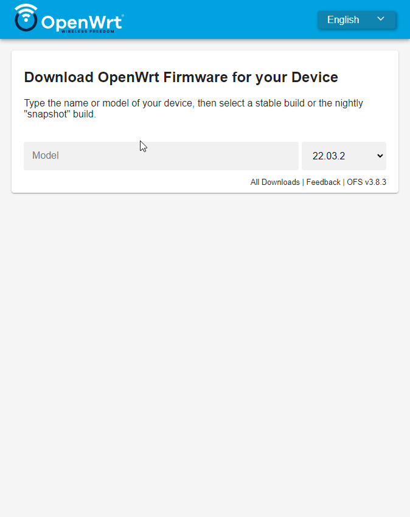
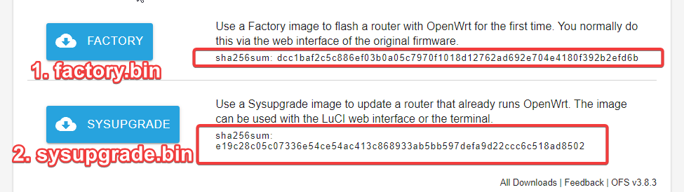
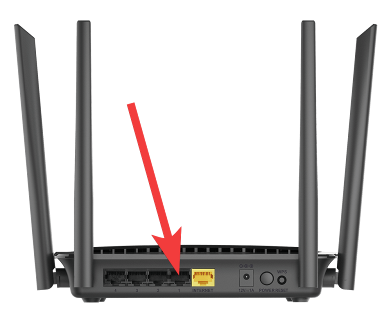
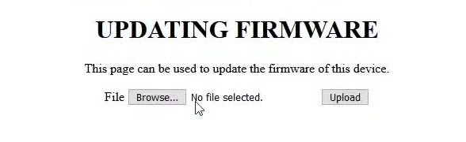
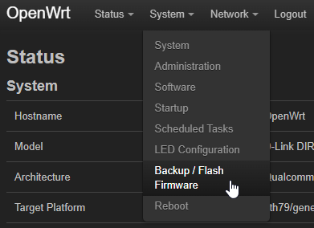
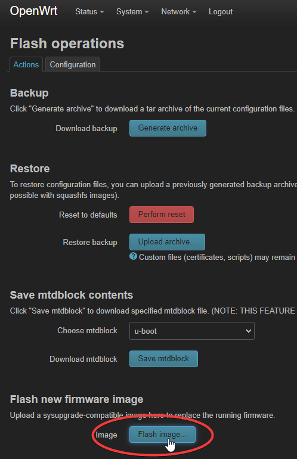
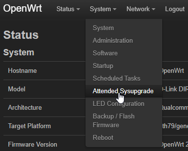
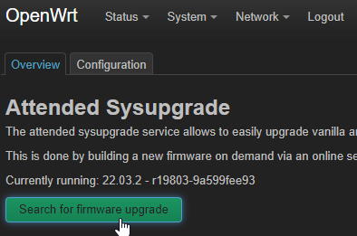

# How to Install OpenWrt on Dlink DIR-842

**Table of content:**

- [Prerequisites](#prerequisites)
- [Get started](#get-started)
  - [Downloading Custom OpenWrt Images](P)
- [Flashing OpenWrt](#flashing-openwrt)
  - [Part Ⅰ : Accessing D-Link recovery mode](#part-ⅰ--accessing-d-link-recovery-mode)
  - [Part Ⅱ : Upgrading OpenWrt firmware in LUCI](#part-ⅱ--upgrading-openwrt-firmware-in-luci)
- [Maintaining Your OpenWrt Up to Date](#maintaining-your-openwrt-up-to-date)
- [Research](#research)

## Prerequisites

- D-Link DIR-842 hw version `C1`, `C2` & `C3`; Others hw version will not work.
- `1x` Ethernet cable.

## Get started

 Visit [OpenWrt Firmware Selector](https://firmware-selector.openwrt.org/) on your local machine.

### Downloading Custom OpenWrt Images  

With OpenWrt Firmware Selector now we can customize which packages to be installed. In this guide I will be adding `luci-app-attendedsysupgrade`,  `luci-proto-relay` & `luci`.  

|  |  
|:--:|  
| *OpenWrt Firmware Selector* |

1. Type the model name in accodingly:  
    Example: `DIR-842 C2`
2. Expand `🔽 Customize installed packages.` Insert this line into the text area below.  

    ```shell
    luci luci-proto-relay luci-app-attendedsysupgrade
    ```

    Addtional packages added:

    |   pakage name |   Description |   Documentation |
    |--- |--- | ---   |
    |   [luci](https://openwrt.org/packages/pkgdata/luci) |   LuCI web interface | [LuCI essential](https://openwrt.org/docs/guide-user/luci/luci.essentials)  |
    |   [luci-proto-relay](https://openwrt.org/packages/pkgdata/luci-proto-relay)	|   Support for relayd pseudo bridges	| [Using Relayd](https://openwrt.org/docs/guide-user/network/wifi/relay_configuration?s[]=luci&s[]=proto&s[]=relay#using_relayd)  |
    |   [luci-app-attendedsysupgrade](https://openwrt.org/packages/pkgdata/luci-app-attendedsysupgrade)	|   LuCI support for attended sysupgrades	|  [Upgrade using Attended Sysupgrade](https://openwrt.org/docs/guide-user/installation/attended.sysupgrade) |

3. Wait until the process finished.  

    |   |  
    |:--:|  
    | *OpenWrt Firmware Selector: Download button* |

4. Click on `FACTORY` & `SYSUPGRADE` to download the firmware.  
5. Rename them to `factory.bin` & `sysupgarde.bin` **Important!**  

## Flashing OpenWrt

**Important:** We must to follow `Part Ⅰ` & `Part Ⅱ` of the process. **DO NOT** power-cycle the router.

### Part Ⅰ : Accessing D-Link recovery mode

|  |  
|:--:|  
| *LAN port 1* |

1. Connect your computer to the D-Link DIR-842 C2 router using an Ethernet cable (use `LAN` port `1`).
2. Unplug power from the device
3. Press and hold the reset button on the device and re-plug the power without releasing the reset button
4. Continue to hold the reset button until the red/orange power light starts blinking
5. On the computer, manually assign a static IP address on the 192.168.0.xxx subnet, other than 192.168.0.1 (e.g. 192.168.0.2)
6. Open a web browser and navigate to <http://192.168.0.1>  

    |  |  
    |:--:|  
    | *D-Link recovery* |

7. Click `Browse..` and choose the `factory.bin` and click on `Upload`  
8. After the file has been uploaded, you should see a “Device is upgrading the firmware” message on the web browser  
9. Wait while the device verify the uploaded file and flash the firmware  
10. The device will reboot automatically after the flashing process finishes. DO NOT turn off the router  

    |  |  
    |:--:|  
    | *Set static IP* |  
11. After a while set your PC to 192.168.1.2 with default gateway 192.168.1.1.  

### Part Ⅱ : Upgrading OpenWrt firmware in LUCI

1. Open a web browser and navigate to <http://192.168.1.1>  
2. Log in to the OpenWrt web interface using the default username and password (usually "root" and a blank password, respectively).  

    |   |  
    |:--:|  
    | *LuCI dropdown menu* |
3. `System` > `Backup / Flash Firmware`  

    |  |  
    |:--:|  
    | *LuCI flash operations* |
4. Click on `Flash Image..`  
5. Choose the `factory.bin` and click on “Upload”
6. The system will reboot
7. That's it! You should now be able to use OpenWrt on your D-Link DIR-842 C2 router.  

### Additional Notes

> Note that flashing a new firmware onto a router can be risky and may result in the loss of all data on the router if something goes wrong. Make sure to follow the instructions carefully and take all necessary precautions to avoid damaging your router.

## Maintaining Your OpenWrt Up to Date

| [](https://www.youtube.com/watch?v=FFTPA6GkJjg&t=1092s)  |  
|:--:|  
| *Youtube video* |

🔼 How to upgrade OpenWrt? - Youtube video from [youtube.com/OneMarcFifty](https://www.youtube.com/@OneMarcFifty)

1. Open a web browser and navigate to <http://192.168.1.1>  

    |  |  
    |:--:|  
    | *LuCI dropdown menu* |

2. `System` > `Attended Sysupgrade`  

    |  |  
    |:--:|  
    | *LuCI Attended Sysupgrade* |
3. Click on `Search for firmware upgrade`
4. The system will reboot

## Research

- [[ OpenWrt Wiki ] D-Link DIR-842](https://openwrt.org/toh/d-link/dir-842)
- [[ Youtube.com/VanTechCorner ] OpenWRT - Install OpenWRT on D-Link DIR-842](https://www.youtube.com/watch?v=fVRWbprCZW8)
- [[ Youtube.com/OneMarcFifty ] How to upgrade OpenWrt?](https://www.youtube.com/watch?v=FFTPA6GkJjg)
- [[ OpenWrt Wiki ] Package table](https://openwrt.org/packages/table/start?dataflt%5BName_pkg-dependencies*%7E%5D=sysupgrade)